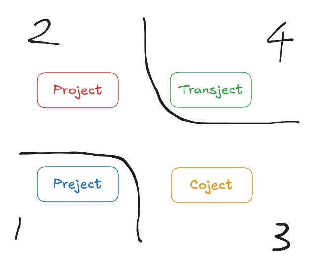

# Four-jects
[English Version](index_EN.md) | [GitHub](https://github.com/stakiran/four-jects)

## Four-jects
### Project
- Pro + ject: activities to move forward
- Consists of project management based on allocated resources and teamwork with static or dynamic members
- A temporary endeavor; it always has a beginning and an end

### Transject
- Trans + ject: activities to cross boundaries
- Consists of solo work that produces shareable deliverables, broadcasting them to all employees, and handling individual Q&A and requests
- A permanent endeavor; you keep operating as an individual player without owning a team or a project

### Preject
- Pre + ject: activities done before a project
- Neither waterfall nor agile: you do exploratory work. You only decide the theme and timebox; during that period, each person explores freely with no management, no meetings, and no interference
- A temporary endeavor; once it ends, you immediately share and reflect, then decide what's next

### Coject
- Co + ject: activities to spend time together
- During working hours, you do interaction activities unrelated to work, such as conversations, games, retreats, and other recreation
- A temporary endeavor; you run it by injecting the human interaction people need as appropriate

## Relationships

- 1
    - If you need exploration before starting a Project, do a Preject. Exploration works best when you remove constraints as much as possible, lean fully into each individual's pace and strengths, and let them focus deeply. **It's a poor fit for a management- and teamwork-heavy Project**
- 2
    - To move forward, you need a Project
    - But Projects tend to increase wasted communication and socializing, so you should keep them minimal in day-to-day work. Because humans can't endure that, you do high-density interaction **separately** as a Coject. In other words, separate project activities from social activities
- 3
    - The talent for solving problems and the talent for defining problems don't coexist. The former, the Solver, should do Projects, but it's absurd to make the latter, the Creator, do Projects. Also, there are quite a lot of people who aren't suited to being Solvers—likely as many as, or more than, sexual minorities and neurodivergent people
    - Exempt the latter from Projects and have them fully commit to Transjects instead. Then, to bring their output into Projects, provide it continuously as well

## Organizing with matrices
Matrix 1:

|  | Temporary | Permanent |
| --- | --- | --- | 
| Forward progress | Project | - |
| Exploration | Preject,Coject | Transject |

Matrix 2:

|  | Solo | Team |
| --- | --- | --- | 
| Forward progress | - | Project |
| Exploration | Tranject | Preject |

## References
- Transject
    - [Project vs Transject - DEV Community](https://dev.to/stakiran/project-vs-transject-cpd)
    - [Engineers, Managers, and Spreaders - DEV Community](https://dev.to/stakiran/engineers-managers-and-spreaders-4fl7)
- Exploratory
    - ["Career Ladder is an Inverted Triangle" Bias - DEV Community](https://dev.to/stakiran/career-ladder-is-an-inverted-triangle-bias-3en5)
    - [Casual Innovation | soft-skills-toolkit](https://stakiran.github.io/soft-skills-toolkit/casual_innovation_EN.html)